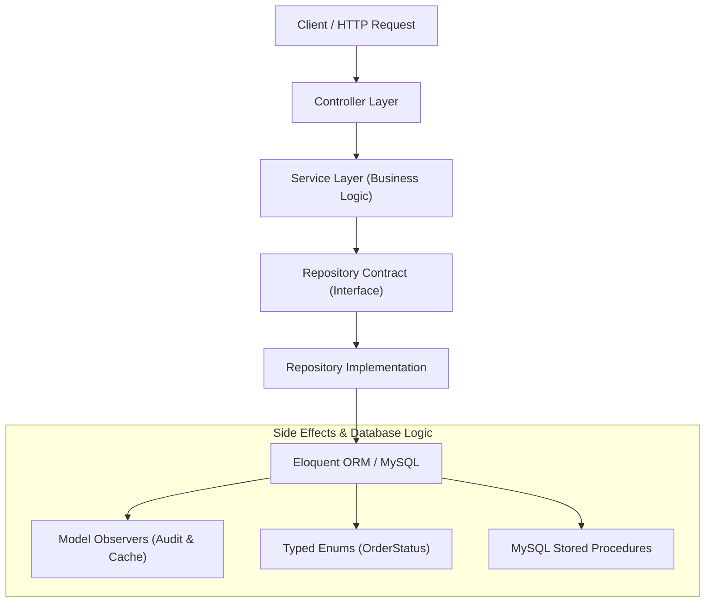
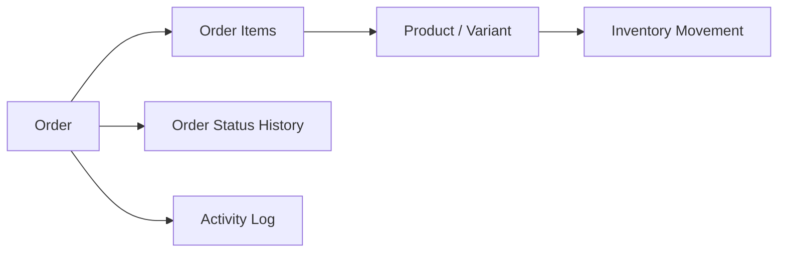

# Laravel E-Commerce

A multi-vendor e-commerce backend built with Laravel, featuring layered service-repository architecture, database-level business logic, relational query optimizations, and historical audit tracking.

---

## Overview

This project implements a multi-vendor e-commerce platform designed to manage product catalogs, shopping carts, transactional order fulfillment, vendor commissions, and customer interactions across multiple user roles (Customers, Vendors, Regional Admins, and Superadmins).

Rather than relying on basic CRUD patterns, the backend handles real-world e-commerce complexities including multi-status order lifecycles, stock movement accounting, automated cache invalidation, database-enforced integrity rules, and encapsulated stored procedures for high-frequency operations.

---

## Core Business Capabilities

- **Multi-Vendor Product Catalog & Variants**: Supports multi-vendor inventory with hierarchical category assignment and product variants (attributes, pricing, stock levels).
- **Order Lifecycle & Fulfillment**: Manages structured order status transitions from placement to fulfillment (`pending` → `processing` → `shipped` → `delivered` → `completed` or `canceled`), with grand total calculations incorporating discounts and shipping fees.
- **Coupon Validation Engine**: Handles percentage-based and fixed-amount coupon calculations with validity date ranges, minimum order thresholds, and usage limits.
- **Inventory Movement Accounting**: Records incremental stock additions, deductions, and adjustments with reference tracking to prevent untracked inventory changes.
- **Review Management & Moderation**: Provides product and blog rating submissions, rating distribution calculations, and moderation approval controls.
- **Subscription Plans & Vendor Operations**: Supports tiered subscription plans for vendors and automated commission tracking per order item.
- **Regional Administrative Scoping**: Restricts regional administrators to managing orders from users within their assigned geographic city using custom Eloquent scopes.
- **Audit & State Tracking**: Preserves historical logs of order status changes, inventory movements, and system activity logs.

---

## Backend Architecture

The application follows a layered architectural pattern to separate HTTP routing, business workflows, data isolation, and persistent storage:



### Layer Responsibilities

- **Controller Layer**: Handles HTTP requests, delegates payload validation to Form Requests, and returns JSON or view responses without containing inline business logic.
- **Service Layer (`app/Services`)**: Encapsulates core business processes. Classes like `OrderService`, `DashboardService`, `SearchFilterService`, `ReviewManagementService`, and `ImageUploadService` centralize calculations, caching strategies, and filtering logic.
- **Repository Pattern (`app/Repositories`)**: Decouples application logic from data access. Interface contracts in `Contracts/` bind to concrete implementations extending `BaseRepository`, allowing structured query building and maintenance isolation.
- **Model Observers (`app/Observers`)**: React to Eloquent lifecycle events (`created`, `updated`, `deleted`) to trigger side effects like recording status changes in `order_status_history` and clearing cached dashboard metrics.
- **Custom Scopes & Policies**: Enforce role-based access control and tenant isolation, such as the `ForAdmin` scope restricting regional admins based on `user_addresses.city`.

---

## Engineering Highlights

### 1. Multi-Step Order State Transitions
- **Business Problem**: Orders moving through invalid status sequences (e.g., from `cancelled` directly to `completed`) corrupt fulfillment workflows.
- **Engineering Challenge**: Enforce valid status transition paths cleanly across application controllers and database updates.
- **Implemented Solution**: Defined valid transition mapping in `OrderService::isValidTransition()` and backed status values with the backed string enum `App\Enums\OrderStatus`. Additionally, encapsulated database-level transitions in the `sp_order_status_transition` stored procedure.
- **Backend Skill Demonstrated**: Lifecycle state management and state machine integrity.

### 2. Database-Enforced Business Constraints
- **Business Problem**: Concurrent requests or UI double-clicks can create duplicate wishlist entries or multiple reviews for the same product by a single customer.
- **Engineering Challenge**: Prevent duplicate record creation reliably without relying solely on application-level checks.
- **Implemented Solution**: Implemented composite unique database indexes (`uq_wishlists_user_product` on `wishlists` and `uq_product_reviews_user_product` on `product_reviews`).
- **Backend Skill Demonstrated**: Relational schema design and database engine-level integrity enforcement.

### 3. Inventory Accounting & Order Auditability
- **Business Problem**: Modifying stock or order status directly overwrites current state, erasing operational history needed for customer support and audit compliance.
- **Engineering Challenge**: Maintain a reliable historical ledger of stock adjustments and status updates without degrading primary query paths.
- **Implemented Solution**: Built dedicated audit models—`OrderStatusHistory` to track `from_status`, `to_status`, and `changed_by`, and `InventoryMovement` to record stock shifts (`in`, `out`, `adjustment`) along with `previous_stock` and `new_stock`. Automatically populated status updates via `OrderObserver`.
- **Backend Skill Demonstrated**: Audit log design and event-driven historical tracking.

### 4. Query Path Indexing & Full-Text Search
- **Business Problem**: Wildcard text searches (`LIKE '%term%'`) and unindexed filters across high-volume tables cause full table scans.
- **Engineering Challenge**: Optimize search throughput for product discovery and administrative order filtering.
- **Implemented Solution**: Added B-tree composite indexes on high-frequency query fields (`orders(status, created_at)` and `products(vendor_id, is_active)`), plus MySQL FULLTEXT indexes (`ft_products_name_description`, `ft_blogs_title_content`, `ft_users_name_email`, and `ft_coupons_code`) for match-against search queries.
- **Backend Skill Demonstrated**: Database query optimization and index design.

### 5. Multi-Tiered Dashboard Query Caching
- **Business Problem**: Executing multiple aggregate statistical queries every time the administrative dashboard loads slows response times.
- **Engineering Challenge**: Deliver real-time recent activity while reducing database aggregate workload for static stats.
- **Implemented Solution**: Developed `DashboardService` with a multi-tier caching strategy—caching heavy aggregate stats for 5 minutes (`dashboard:stats`) and chart trends for 1 hour (`dashboard:charts`), while keeping recent orders real-time. Automatically invalidated caches via `OrderObserver` and `ProductObserver` on data mutation.
- **Backend Skill Demonstrated**: Cache strategies, TTL management, and observer-driven cache invalidation.

### 6. Encapsulated Stored Procedures
- **Business Problem**: Executing complex multi-step validations or heavy reporting aggregations in PHP increases database round-trips and memory footprint.
- **Engineering Challenge**: Offload intensive analytical calculations and coupon validation logic directly to the database engine.
- **Implemented Solution**: Written MySQL stored procedures including `sp_apply_coupon` (atomic rule checking for expiry, usage caps, order minimums, and discount math), `sp_vendor_commission_report` (calculating payouts based on vendor rates), and `sp_admin_dashboard_stats`.
- **Backend Skill Demonstrated**: Database programming and stored procedure integration within migrations.

---

## Order & Inventory Domain Workflow

The order and inventory subsystems maintain traceability across customer activity, item purchases, stock adjustments, and administrative oversight:



- **Traceability**: Every purchase links back to specific product variants and vendor records.
- **Stock Auditability**: Deductions or adjustments create an `InventoryMovement` row recording reference entity IDs, previous balance, new balance, and responsible user ID.
- **Status Change Visibility**: Transitions log the previous state, new state, operating user, and optional administrative notes in `OrderStatusHistory`.

---

## Database Engineering

Database engineering is a primary highlight of this repository, emphasizing schema normalization, transactional constraints, and query optimization:

- **Schema Normalization**: Normalized tables for multi-vendor relationships, variants, addresses, plans, subscriptions, and reviews.
- **Foreign Key Constraints**: Cascading foreign keys maintain relational integrity across order items, reviews, images, and addresses.
- **Targeted B-Tree & Composite Indexes**:
  - `idx_orders_status_created` on `orders(status, created_at)` for paginated status queries.
  - `idx_products_vendor_active` on `products(vendor_id, is_active)` for vendor store front filtering.
  - Performance indexes on `categories.parent_id`, `users.role`, `coupons.is_active`, and `subscriptions.status`.
- **Unique Integrity Constraints**:
  - `uq_wishlists_user_product` prevents duplicate items per user in wishlists.
  - `uq_product_reviews_user_product` limits users to one review per product.
- **Full-Text Search Indexes**:
  - `ft_products_name_description` on `products(name, description)`.
  - `ft_blogs_title_content` on `blogs(title, content)`.
  - `ft_users_name_email` on `users(name, email)`.
  - `ft_coupons_code` on `coupons(code)`.
- **Polymorphic Indexing**: `idx_images_imageable` on `images(imageable_type, imageable_id)` for generic image attachments across products and blogs.
- **MySQL Stored Procedures**: Encapsulated SQL logic in database migrations (`2026_02_11_160004_create_stored_procedures.php`) for status transitions, coupon processing, dashboard statistics, monthly trend analysis, and vendor commission reporting.

---

## Security & Authorization

- **Role-Based Access Control (RBAC)**: Supports roles (`user`, `vendor`, `admin`, `superadmin`) evaluated in service layers and policies.
- **Policy Enforcement**: Model policies govern resource manipulation rules (e.g., verifying review authorship or administrative privileges).
- **Form Request Input Validation**: Form Requests sanitize and validate incoming parameters prior to hitting controllers.
- **Contextual Tenant Scoping**: Scope `ForAdmin` dynamically restricts query scopes based on user role and administrative city assignment.

---

## Testing & Quality Assurance

The codebase includes an automated test suite built with **Pest** (extending PHPUnit `TestCase`) utilizing `RefreshDatabase`:

- **Framework**: Pest PHP testing framework (`tests/Pest.php`).
- **Feature Tests (`tests/Feature/`)**: Test coverage for Order factory creation, order item associations, grand total calculations, role authorization policies (`AuthorizationTest.php`), admin city-based scoping (`OrderTest.php`), product reviews, user profiles, and vendor interactions.
- **Isolation**: Each test execution runs within database migrations to guarantee isolated state evaluation.

---

## Technology Stack

| Category | Technologies / Libraries |
| :--- | :--- |
| **Backend Framework** | PHP 8.2+, Laravel 11 framework |
| **Database & ORM** | MySQL, Eloquent ORM, B-Tree Indexes, FULLTEXT Indexes, Stored Procedures |
| **Architecture** | Layered Services, Repository Pattern (Contracts), Model Observers, Typed Enums, Form Requests |
| **Testing** | Pest PHP, PHPUnit framework, Laravel Dusk (Browser setup) |
| **Frontend Utilities** | Vite, TailwindCSS (for Blade view rendering) |

---

## Setup & Installation

### Prerequisites

- PHP >= 8.2
- Composer
- MySQL >= 8.0
- Node.js & NPM

### Local Installation Steps

1. **Clone Repository & Install Dependencies**:
   ```bash
   git clone <repository-url>
   cd ecommerce
   composer install
   npm install
   ```

2. **Environment Configuration**:
   ```bash
   cp .env.example .env
   php artisan key:generate
   ```
   *Configure your MySQL connection details in `.env` (`DB_DATABASE`, `DB_USERNAME`, `DB_PASSWORD`).*

3. **Run Database Migrations & Seeders**:
   ```bash
   php artisan migrate --seed
   ```
   *This executes table creation, index additions, stored procedures, and seeds initial data.*

4. **Run Test Suite**:
   ```bash
   vendor/bin/pest
   ```

5. **Start Local Development Server**:
   ```bash
   php artisan serve
   ```
